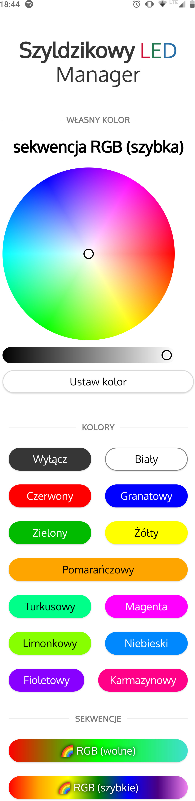

# szyldzikowy-led-manager
Oprogramowanie do ESP8266 pozwalające na sterowanie paskiem LED RGB przez nowoczesne Web UI. Oryginalnie stworzone jako prezent urodzinowy :)

## Instalacja
Wgrać `szyldzik/szyldzik.ino` do płytki. 
Przy pierwszym włączeniu pojawi się sieć `Szyldzikowy LED Manager` w której można przeprowadzić konfigurację, łącząc się z `192.168.4.1` (lub klikając przycisk "Zaloguj" w telefonie/komputerze).
W następnych uruchomieniach płytka nasłuchuje na `http://szyldzik.local` i `http://ip płytki`.

## Prezentacja

Linijka LED użyta jako podświetlenie płyty akrylowej:

Web UI dołączone do oprogramowania:

##

Copyright 2021 Robert "revox" Piotrowski
